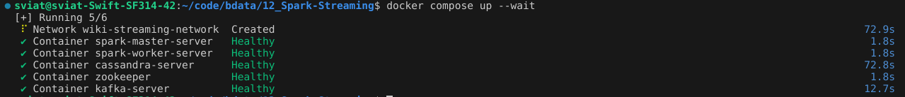
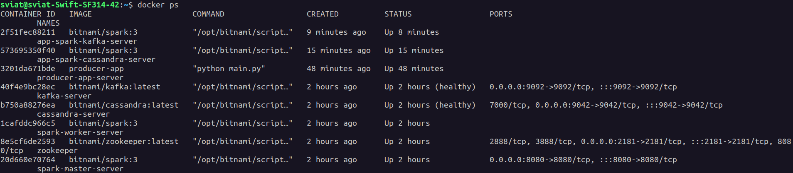
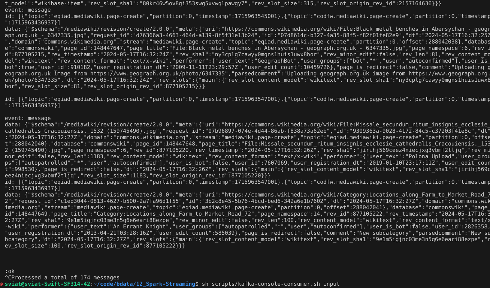
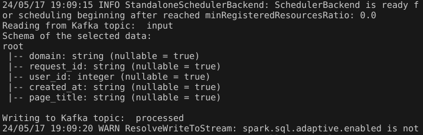
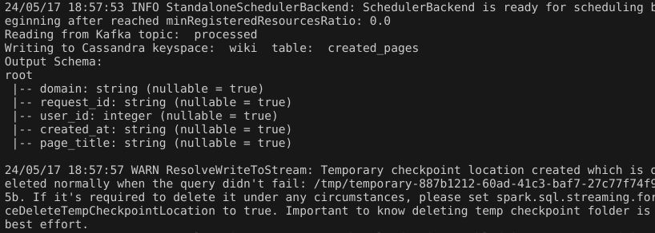
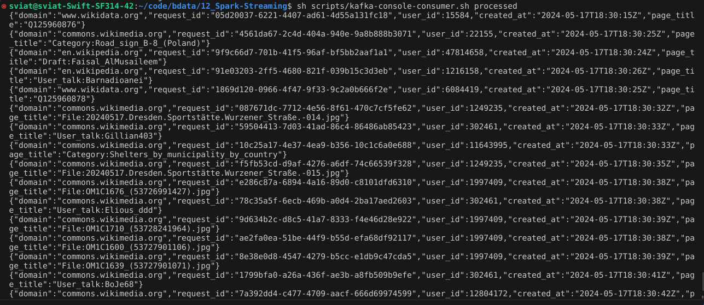
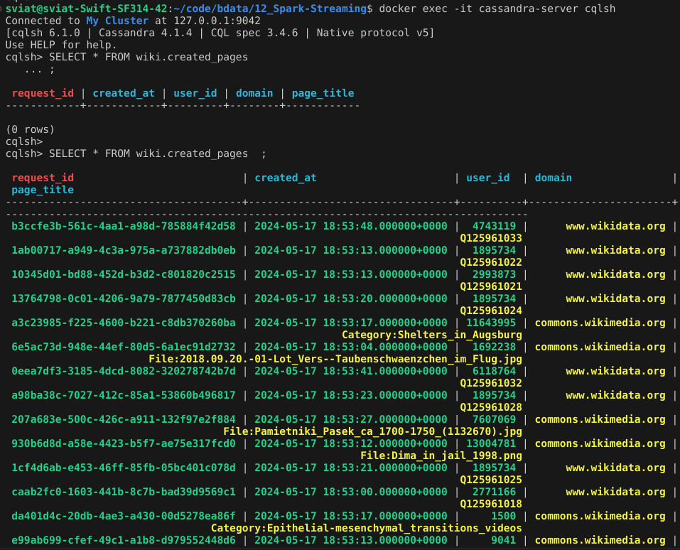
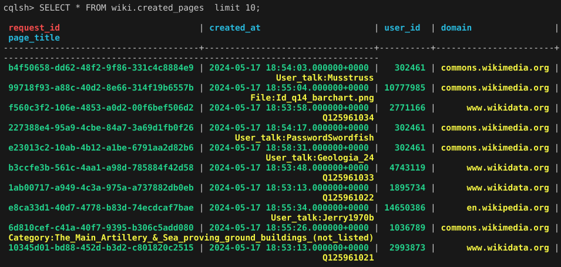
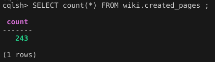
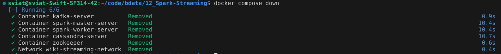

# Homework 12: 🤖 Spark Streaming

Author: **Sviatoslav Lushnei**

## 📝 Description

Write a data from endpoint to cassandra using spark streaming and several Kafka topics as intermediate steps.

## Structure:

### 1. Scripts

[`scripts`](./scripts) - folder with bash scripts for the cluster and app

- [`build-app-image.sh`](./scripts/build-app-image.sh) - script to build the app image, for the Kafka Producer
- [`run-endpoint-app.sh`](./scripts/run-endpoint-app.sh) - script to run the endpoint app, that writes data to the Kafka topic

Usage: 
```bash
sh scripts/run-endpoint-app.sh <command>
# or to run the default command
sh scripts/run-endpoint-app.sh 
# Example:
sh scripts/run-endpoint-app.sh bash
```

- [`kafka-console-consumer.sh`](./scripts/kafka-console-consumer.sh) - script to run the Kafka console consumer

Usage: 
```bash
sh scripts/kafka-console-consumer.sh <topic>
# Example:
sh scripts/kafka-console-consumer.sh input
```

- [`spark-kafka-run.sh`](./scripts/spark-kafka-run.sh) - script to run the Spark program to read data from Kafka and process it and write to another Kafka topic
Usage: 
```bash
sh scripts/spark-kafka-run.sh <command>
# or to run the default command
sh scripts/spark-kafka-run.sh
# Example:
sh scripts/spark-kafka-run.sh bash
```


- [`spark-cassandra-run.sh`](./scripts/spark-cassandra-run.sh) - script to run the Spark program to write data from Kafka to Cassandra
Usage: 
```bash
sh scripts/spark-cassandra-run.sh <command>
# or to run the default command
sh scripts/spark-cassandra-run.sh 
# Example:
sh scripts/spark-cassandra-run.sh bash
```

- [`init-kafka-topics.sh`](./scripts/init-kafka-topics.sh) - script used by compose to create the Kafka topics

- [`ddl.cql`](./scripts/ddl.cql) - file with the Cassandra schema, initialized by the compose

- - - 
### 2. Endpoint App

[`endpoint-reader-app`](./endpoint-reader-app) - folder with the producer app for `input`  Kafka topic, Dockerfile and requirements

- [`main.py`](./endpoint-reader-app/main.py) - python script to read data from the endpoint and write it to the Kafka topic

```bash
root@aecd5a3eb6f2:/app# python main.py --help
usage: main.py [-h] [--endponint_path ENDPONINT_PATH]
               [--bootstrap_servers BOOTSTRAP_SERVERS] [--topic TOPIC]
               [--log_every LOG_EVERY] [--post_limit POST_LIMIT]

Read messages from the stream and write to Kafka topic

options:
  -h, --help            show this help message and exit
  --endponint_path ENDPONINT_PATH
                        Endpoint path to get the stream of the wiki pages (default:
                        https://stream.wikimedia.org/v2/stream/page-create)
  --bootstrap_servers BOOTSTRAP_SERVERS
                        Kafka server address (default: kafka:9092)
  --topic TOPIC         Kafka topic name to write to (default: input)
  --log_every LOG_EVERY
                        Log every N messages posted (default: 100)
  --post_limit POST_LIMIT
                        Limit the number of messages to post (-1 to post all) (default:
                        -1)
```

---
### 3. Spark Programs

[`cassandra-populating-app`](./cassandra-populating-app) - folder with the Spark programs

- [`kafka-spark.py`](./cassandra-populating-app/kafka-spark.py) - python script to read data from one kafka topic, process it and write to another kafka

```bash
I have no name!@46cee4484884:/opt/bitnami/spark$ spark-submit /app/kafka-s
park.py --help
usage: kafka-spark.py [-h] [--bootstrap-servers BOOTSTRAP_SERVERS]
                      [--read_topic READ_TOPIC] [--write_topic WRITE_TOPIC]
                      [--master MASTER] [--app_name APP_NAME]
                      [--log_level {WARN,INFO,DEBUG}] [--cores_max CORES_MAX]
                      [--executor_mem EXECUTOR_MEM]

Read messages from Kafka topic, filter them, and write to another Kafka topic.

optional arguments:
  -h, --help            show this help message and exit
  --bootstrap-servers BOOTSTRAP_SERVERS
                        Kafka bootstrap servers (default: kafka:9092)
  --read_topic READ_TOPIC
                        Kafka topic name to read messages from (default:
                        input)
  --write_topic WRITE_TOPIC
                        Kafka topic name to write filtered messages to
                        (default: processed)
  --master MASTER       Spark master URL (default: spark://spark-master-
                        server:7077)
  --app_name APP_NAME   Name of the Spark application (default: Kafka-Spark-
                        Kafka)
  --log_level {WARN,INFO,DEBUG}
                        Log level for the Spark context (default: WARN)
  --cores_max CORES_MAX
                        Maximum number of cores to use (default: 1)
  --executor_mem EXECUTOR_MEM
                        Memory allocated to each executor (default: 1g)
24/05/17 20:26:22 INFO ShutdownHookManager: Shutdown hook called
24/05/17 20:26:22 INFO ShutdownHookManager: Deleting directory /tmp/spark-8c6490d4-07ae-4818-b3b7-77c8696424e6
```

- [`spark-cassandra.py`](./cassandra-populating-app/spark-cassandra.py) - python script to read data from Kafka topic and write it to Cassandra

```bash
I have no name!@46cee4484884:/opt/bitnami/spark$ spark-submit /app/kafka-cassandra.py --help
usage: kafka-cassandra.py [-h] [--bootstrap-servers BOOTSTRAP_SERVERS]
                          [--read_topic READ_TOPIC] [--master MASTER]
                          [--app_name APP_NAME]
                          [--log_level {WARN,INFO,DEBUG}]
                          [--cores_max CORES_MAX]
                          [--executor_mem EXECUTOR_MEM]
                          [--cassandra_host CASSANDRA_HOST]
                          [--cassandra_port CASSANDRA_PORT]
                          [--keyspace KEYSPACE] [--table TABLE]

Read messages from Kafka topic and write to Cassandra.

optional arguments:
  -h, --help            show this help message and exit
  --bootstrap-servers BOOTSTRAP_SERVERS
                        Kafka bootstrap servers (default: kafka:9092)
  --read_topic READ_TOPIC
                        Kafka topic name to read messages from (default:
                        processed)
  --master MASTER       Spark master URL (default: spark://spark-master-
                        server:7077)
  --app_name APP_NAME   Name of the Spark application (default: Kafka-Spark-
                        Cassandra)
  --log_level {WARN,INFO,DEBUG}
                        Log level for the Spark context (default: WARN)
  --cores_max CORES_MAX
                        Maximum number of cores to use (default: 1)
  --executor_mem EXECUTOR_MEM
                        Memory allocated to each executor (default: 1g)
  --cassandra_host CASSANDRA_HOST
                        Cassandra host (default: cassandra)
  --cassandra_port CASSANDRA_PORT
                        Cassandra port (default: 9042)
  --keyspace KEYSPACE   Cassandra keyspace (default: wiki)
  --table TABLE         Cassandra table (default: created_pages)
```
### 4. Other
- [`docker-compose.yaml`](./docker-compose.yaml) - file with the configuration for the Spark, Kafka, Zookeeper, and Cassandra
- [`results/img`](./results/img) - folder with the screenshots of the console output
- [`start-all.sh`](./start-all.sh) - script to start the cluster and all apps, plaese use it wisely, and better to follow the steps in the readme
- [`stop-and-delete-all.sh`](./stop-and-delete-all.sh) - script to stop the cluster and all apps


## 🖥 Usage

Please run the commands from the folder where that readme is located (hw9-Spark-Deployment).

### How to run the application
After cloning the repository, navigate to the root folder of the lab and run the following commands:

#### 1. Run the cluster with all services (Spark, Kafka, Zookeeper, Cassandra):
```bash
docker compose up -d # or with --wait flag, to wait for the services to start healthily
```
The possible services are:
- `kafka` and `zookeeper` - for the Kafka
- `spark` and `spark-worker` - for the Spark
- `cassandra` - for the Cassandra

#### 2. Build and run the app image for the Kafka Producer:
```bash
sh scripts/build-app-image.sh
sh scripts/run-endpoint-app.sh
```

#### Other usage examples:
- see the help message:
```bash
sh scripts/run-endpoint-app.sh "python /app/main.py --help"
```
#### 3. Run Kafka-Spark program:

```bash
sh scripts/spark-kafka-run.sh
# or with the manual command
sh scripts/spark-kafka-run.sh <command>
```

Processed data format that is written to the `processed` Kafka topic:

```bash
root
 |-- domain: string (nullable = true)
 |-- request_id: string (nullable = true)
 |-- user_id: integer (nullable = true)
 |-- timestamp: string (nullable = true)
 |-- page_title: string (nullable = true)
```

#### 4. Run Spark-Cassandra program:
```bash
sh scripts/spark-cassandra-run.sh
# or with the manual command
sh scripts/spark-cassandra-run.sh <command>
```

#### 5. Stop the cluster:
- You can stop the cluster using the command:
```bash
docker compose down
```
To stop the apps running you can use Ctrl+C in the terminal where the app is running, or Stop the container.

- Or you can stop and delete all using the script:
```bash
sh stop-and-delete-all.sh
```

## 📊 Results

1. Run the cluster in detached mode:


3. All containers are running:


3. Kafka producer app from the endpoint:


- and we can see the data in the `input` Kafka topic:


4. Start the Spark programs, log output:




5. The data in the `processed` Kafka topic:


6. Results in the Cassandra:
- here we can see that are present entries within the 5+ minutes


- the more results


- number of entries in the Cassandra

5. Shutdown down the cluster:


## 📌 Notes
_All the results of the test are located in the [`results`](./results) folder with the screenshots of the console output._

- Note that using manual commands you can run the Spark programs with the different parameters, like the Kafka topics, Cassandra keyspace, etc. But the default values are set in the scripts and are working with the default configuration of the cluster. If you want to use manual commands, do it carefully.
