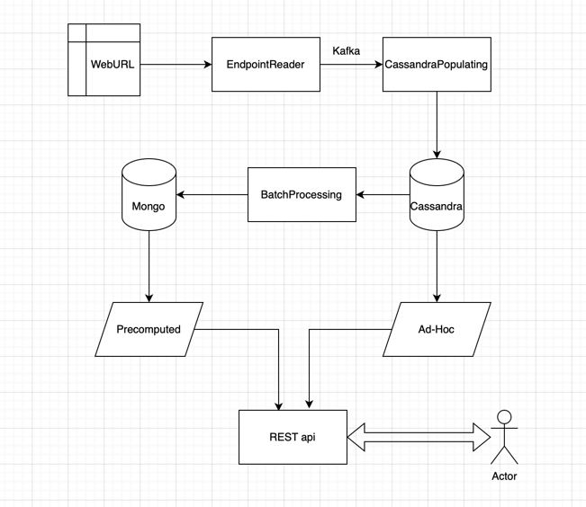

## Intro

- Project name: Wikipedia data analysis
- Link to repository: [GitHub](https://github.com/sviat-l/big-data-project.git)
- Description: the primary goal of the project is to implement a system that includes data storage and modeling, batch, and streaming processing, to analyze Wikipedia data and provide the results via REST API.

## How to run
```bash
docker compose up -d
```
open `http://localhost:4200/docs` in your browser

to stop the project
```bash
docker compose down
```

## Diagram

A diagram of the project's architecture:



### Services Description/Motivation
- Cassandra:
We have chosen cassandra as out primary database because it is designed to handle heavy write workloads. 
- MongoDB:
We have chosen MongoDB as an additional database to store precomputed data for faster access.
- kafka/spark:
We have chosen Kafka and Spark for stream processing because they are designed to handle large amounts of data in real-time.
- **Endpoint-reader**:
  - Tools: `KafkaProducer`, `requests`
  - Description: This service is responsible for continuously reading the live stream of page creations from the Wikipedia website and publishing these messages to a Kafka topic. Firstly, it sends a request to the Wikipedia API to get the latest page creations. Then, it sends each page creation as a message to the Kafka topic. 
- **cassandra-populating**:
  - Tools: `spark`, `spark.streaming`, `cassandra-driver`, `kafka`
  - Description: This service is responsible for consuming messages from the Kafka topic, preprocessing the data with a spark streaming job, and storing the data in the Cassandra database. Firstly, we create the Spark session, next we read messages from Kafka topic as a stream, we process the input data from the stream and return in the format to write to Cassandra.
- **batch-processing**
  - Tools: `cassandra-driver`, `pymongo`
  - Description: This service is responsible for batch processing the data in the Cassandra database and storing the precomputed data in the MongoDB database. Firstly, we connect to the Cassandra database and read the data for batch processing. Next, we process the data and store the precomputed data in the MongoDB database. It allows us to retrieve the data faster and relieve the primary database from heavy queries.
- REST app 
  - Tools: `fastapi`, `cassandra-driver`, `pymongo`
  - Description: This service is responsible for serving the data via REST API. It connects to the Cassandra and MongoDB databases to retrieve the data and return it to the client. We have implemented several endpoints to provide information about pages, users, and domains. We have also implemented endpoints to provide precomputed data for faster access.

## Data Models
### Cassandra tables

As we are using a cassandra database as primary storage, we need to define a table schema for each endpoint to make data selection in the most efficient way. 

- `/domains/all`
```ddl
CREATE TABLE IF NOT EXISTS wiki.domain_pages (
    domain TEXT,
    page_id INT,
    PRIMARY KEY (domain, page_id),
);
```

This table is used to store information about all domains with created pages. The `domain` column is used as a partition key, and the `page_id` column is used as a clustering key. This schema allows us to get all pages for a specific domain in a single query.

- `/users/{user_id}/pages`
```ddl
CREATE TABLE IF NOT EXISTS wiki.user_pages (
    user_id INT,
    page_id INT,
    page_title TEXT,
    PRIMARY KEY (user_id, page_id),
);
```

This table is used to store information about pages created by a specific user. The `user_id` column is used as a partition key, and the `page_id` column is used as a clustering key. This schema allows us to get all pages created by a specific user in a single query.

- `/domains/{domain_id}/pages`
```ddl
CREATE TABLE IF NOT EXISTS wiki.domain_pages (
    domain TEXT,
    page_id INT,
    PRIMARY KEY (domain, page_id),
);
```

This table is used to store information about all pages created in a specific domain. The `domain` column is used as a partition key, and the `page_id` column is used as a clustering key. This schema allows us to get all pages created in a specific domain in a single query.

- `/pages/{page_id}`
```ddl
CREATE TABLE IF NOT EXISTS wiki.pages (
    page_id INT,
    page_title TEXT,
    domain TEXT,
    PRIMARY KEY (page_id, domain),
);
```

This table is used to store information about a specific page. The `page_id` column is used as a partition key, and the `domain` column is used as a clustering key. This schema allows us to get information about a specific page in a single query.

- `/pages-by_users/?from={from}&to={to}`
```ddl
CREATE TABLE IF NOT EXISTS wiki.pages_by_date (
    created_at TEXT,
    page_id INT,
    page_title TEXT,
    user_id INT,
    user_text TEXT,
    PRIMARY KEY (user_id, created_at, page_id),
);
```

This table is used to store information about pages created by users within a specific time range. The `user_id` column is used as a partition key, the `created_at` column is used as a clustering key, and the `page_id` column is used as a clustering key. This schema allows us to get all pages created by users within a specific time range in a single query.


### MongoDB

We are using MongoDB as an additional database to store precomputed data for faster access and because our data is JSON-like. Another point is to relieve our primary database from heavy queries. We prepare the data in advance with batch processing and store it in MongoDB for quick retrieval. 

- `/domains/stats`
```json
{
    "time_start": "12.00",
    "time_end": "13.00",
    "statistics": [{
        "domain": "en.wikipedia.org",
        "page_count": 100
    }, 
    {
        "domain": "de.wikipedia.org",
        "page_count": 50
    }]
}
```

This document is used to store statistics about the number of pages created in each domain within a specific time range. The `time_start` and `time_end` fields are used to specify the time range, and the `statistics` field is an array of objects containing information about each domain.

- `/domains/stats/by_bots`
```json
{
    "time_start": "12.00",
    "time_end": "13.00",
    "statistics": [{
        "domain": "en.wikipedia.org",
        "bot_page_count": 20
    }, 
    {
        "domain": "de.wikipedia.org",
        "bot_page_count": 10
    }]
}
```

This document is used to store statistics about the number of pages created by bots in each domain within a specific time range. The `time_start` and `time_end` fields are used to specify the time range, and the `statistics` field is an array of objects containing information about each domain.

- `/users/most-productive`
```json
{
    "time_start": "12.00",
    "time_end": "13.00",
    "users": [{
        "user_id": 1,
        "user_name": "user1",
        "total_pages": 2,
        "page_titles": ["page1", "page2"]
    }, 
    {
        "user_id": 2,
        "user_name": "user2",
        "total_pages": 4,
        "page_titles": ["page1", "page2"]
    }]
}
```

This document is used to store information about the most productive users within a specific time range. The `time_start` and `time_end` fields are used to specify the time range, and the `users` field is an array of objects containing information about each user.

## Endpoints

### Ah-hoc
1. `GET /domains/all` - returning information about all domains with created pages
- endpoint `GET /domains/all` + description or fastapi docs screenshot
- return schema, description or fastapi docs screenshot
2. `GET /users/{user_id}/pages` - returning information about pages created by a specific user
3. `GET /domains/{domain_id}/pages` - returning information about all pages created in a specific domain
4. `GET /pages/{page_id}` - returning information about a specific page
5. `GET /pages-by_users/?from={from}&to={to}` - returning information about pages created by users within a specific time range
### Pre-calculated
1. `GET /domains/stats` - returning statistics about the number of pages created in each domain within a last 6 hours
2. `GET /domains/stats/by_bots` - returning statistics about the number of pages created by bots in each domain within a last 6 hours
3. `GET /users/most-productive` - returning information about users with most created pages within a last 6 hours.

## Results
### Ad-hoc
1, 2, 3, 4, 5
### Pre-calculated
1, 2, 3


## Add-on:
- repository structure
